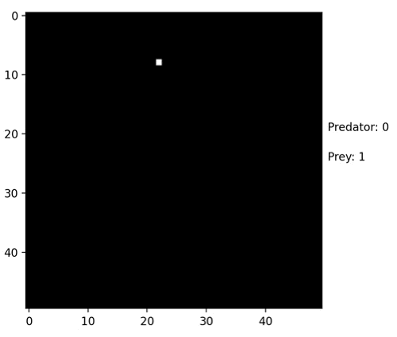
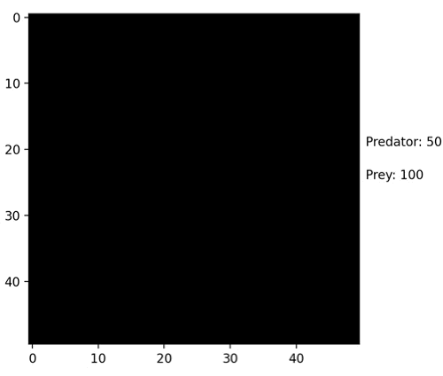
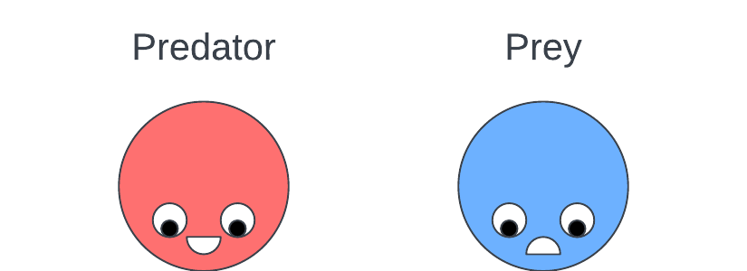

# Prey and Predator simulation

## Introduction

This project is a simulation of a prey and predator ecosystem. The prey and predator are animals that lives on a 2D grid. They are free to move around, have a energy level and can reproduce. The prey is a herbivore and consume grass by moving to a new cell, while the predator is a carnivore and consume the preys.

## Development

### Phase 1

The initial stage is inspired by the [Game of Life](https://en.wikipedia.org/wiki/Conway%27s_Game_of_Life) by John Conway. In Conway's Game of Life, the cells are either alive or dead. The cells are updated based on the number of alive cells around it. The rules are as follows:

1. Any live cell with fewer than two live neighbours dies, as if by underpopulation.
2. Any live cell with two or three live neighbours lives on to the next generation.
3. Any live cell with more than three live neighbours dies, as if by overpopulation.
4. Any dead cell with exactly three live neighbours becomes a live cell, as if by reproduction.

Such simple rules can create complex patterns, check Google's Eastern [Egg](https://www.google.com/search?q=conway+game+of+life&rlz=1C5CHFA_enAU978AU980&oq=conway+game+of+life&gs_lcrp=EgZjaHJvbWUyBggAEEUYOTIHCAEQLhiABDINCAIQLhiDARixAxiABDINCAMQLhivARjHARiABDIHCAQQABiABDIHCAUQLhiABDIHCAYQABiABDINCAcQLhivARjHARiABDIHCAgQABiABNIBCDc5ODVqMGo3qAIAsAIA&sourceid=chrome&ie=UTF-8).

I then modified the rules to create a prey and predator simulation. The rules are as follows:

1. Prey and predator are animals on a boarder-less 2D grid.
2. In this primal age, they have yet developed the ability to think, so they move randomly (up, down, left, right).
3. The prey is a herbivore and consume grass by moving to a new cell.
4. The predator is a carnivore and consume the preys. The predator can sense if there is a prey in the adjacent 8 cells, if so, it will move to the prey's cell and consume it.
5. Both the prey and predator have a energy level, if the energy level is 0, they will die.
6. Both the prey and predator can reproduce, if they have enough energy, they will reproduce and create a new animal in a random adjacent cell.

I call this wonderers' simulation.

 

  

  <em>GIF 1: Prey move and reproduce</em>

 

 

  

  <em>GIF 2: Predator move and die when use all energy</em>

 

 

  

  <em>GIF 3: Predator move and eat nearby prey</em>

A simulation starting with 100 preys and 50 predators will look like this:

 

  

  <em>GIF 4: Wonderers' simulation</em>

 

### Phase 2

In the second stage, I use Pygame to create the GUI for simulation. Matplotlib is too week to create GUI that can demonstrate the crucial part of the simulation XD. In the Pygame version, the prey and predator are basically following the same rules as the previous version. The biggest differences are that the animals now can move with a velocity and speed, hence they can move much more freely and smoothly.

 

  

  <em>PNG 1: Prey & Predator close-up</em>

 

  

  <em>GIF 5: phase_2 simulation.gif</em>

 

### Phase 3

Animals are continuously evolving, they now have the ability to sense outer world and make decisions. In this stage, I implemented the NEAT algorithm for the animals. Each animal has a genome, the animal live the longest in the simulation will be able to pass its genome to the next generation. The next generation will have a chance to mutate its genome. The mutation can be a new connection between neurons, a new neuron, or a new weight for the connection. Consequently, the animals are able to sense outer world with their antennas.

This stage is inspired by the [ai-car-simulation](https://github.com/NeuralNine/ai-car-simulation/tree/master), and the [Evolving AI, Prey vs Predator](https://www.youtube.com/watch?v=qwrp3lB-jkQ&t=335s). All code are written from scratch with my own understanding.

### Phase 4

The NEAT algorithm appears to be working well, but the animals are still not smart enough. After all, the improvement of the animals are based on random mutations. In this stage, I implemented the Deep Q-Learning algorithm for the animals. The animals are now able to systematically learn from their experience, by knowing the expected reward of each action.
